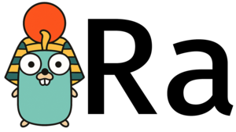

# Ra

A Go library for CLI arg parsing. Powers the argument parsing in [Rad](https://github.com/amterp/rad)!

## Overview

Existing libraries such as cobra, pflag are great, but are not quite flexible enough to meet the needs of
Rad, and are missing crucial features. The goal of this Rad Args library is
to fulfill this role, in a reusable way, so that other projects may benefit as well.

POSIX compliance is up to the user, but not imposed by the library.

More details to come.

## 🚧 Under Development 🚧

### Build out API

- Additional types
- Relational constraints
- Regex
- Enum
- Interactive mode
- Usage string override
- Custom usage coloring theme
- Disable unknown/missing args checks
- Inspect what was parsed, what was not
- Change Set to With?

### Examples

- commands
- common flags between commands
- `--` ending
