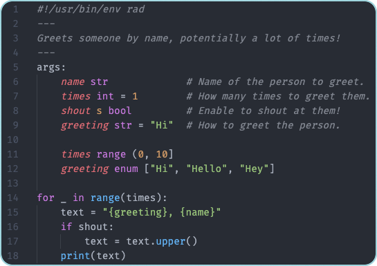

# 🤙 Rad

[](https://github.com/amterp/rad/releases)
[](https://amterp.github.io/rad/)
[](https://goreportcard.com/report/github.com/amterp/rad)
[](https://opensource.org/licenses/MIT)

**Bash is powerful but painful. Rad gives you Python-like scripting with CLI superpowers built-in.**

Write maintainable scripts with declarative argument parsing, built-in JSON processing, HTTP requests, and interactive
user prompts - all in a familiar, readable syntax.

## The Problem with Bash


**What you actually want:**



**You get this for free:**

```shell
> ./greet --help
Greets someone by name, potentially a lot of times!

Usage:
  greet <name> [times] [shout] [greeting]

Script args:
      --name str          Name of the person to greet.
      --times int         How many times to greet them. Range: (0, 10] (default 1)
  -s, --shout             Enable to shout at them!
      --greeting str      How to greet the person. Valid values: [Hi, Hello, Hey]. (default Hi)
```

```shell
> ./greet bob 3 -s
HI, BOB!
HI, BOB!
HI, BOB!
```

## Why Rad? 🚀

- **CLI-first design** → Args, validation, and `--help` are part of the language
- **Familiar syntax** → Python-like, readable, no Bash footguns
- **Declarative arguments** → Automatic `--help`, type checking, validation, and parsing
- **JSON made easy** → Simple paths for extraction and tabular output
- **HTTP built-in** → Query APIs, process results, and render tables in a few lines
- **Interactive prompts** → `pick()`, `input()`, etc, for user input & selection menus
- **Shell when you want it** → Run commands and capture output

## Real-World Example: API to Table

Fetch and display GitHub commits in one, minimal script:

```rad
#!/usr/bin/env rad
args:
    repo str        # The repo to query. Format: user/project
    limit int = 20  # Max commits to return

url = "https://api.github.com/repos/{repo}/commits?per_page={limit}"

Time = json[].commit.author.date
Author = json[].commit.author.name
SHA = json[].sha

rad url:
    fields Time, Author, SHA
```

Put this `commits` script on your PATH, and invoke:

```shell
> commits spf13/cobra 3
Querying url: https://api.github.com/repos/spf13/cobra/commits?per_page=3
Time                  Author          SHA
2025-03-07T14:53:22Z  styee           4f9ef8cdbbc88c5302be95e0e67fd78ebbfa9dd2
2025-02-21T12:46:14Z  Fraser Waters   1995054b003053cc1e404bccfbf6d168e8731509
2025-02-17T19:16:17Z  Yedaya Katsman  f98cf4216d3cb5235e6e0cd00ee00959deb1dc65
```

No `curl | jq | awk` gymnastics. No argparse boilerplate. Just readable code that does what you want.

Explaining the above script:

1. The script takes two args: a repo string and an optional limit (defaults to 20).
    - The `#` comments are read by Rad and used to generate helpful docs / usage strings for the script.
2. It uses string interpolation to build the url we will query, based on the supplied args.
3. It defines the fields to extract from the JSON response.
4. It executes the query, extracting the specified fields from the response, and displays the resulting data as a table.
    - Note the `rad url` syntax: "rad" actually stands for "request and display", which is what this built-in syntax
      does.

This example is kept somewhat minimal - there are Rad features we could use to further improve this.

Some alternative valid invocations for this example:

- `> commits amterp/rad`
- `> commits --repo amterp/rad --limit 5`
- `> commits --limit 5 --repo amterp/rad`
- `> commits amterp/rad --limit 5`

## Quick Comparison 📊

| Feature                | Bash                      | Python                        | Rad                           |
|------------------------|---------------------------|-------------------------------|-------------------------------|
| Syntax familiarity     | Archaic, hard to remember | Familiar                      | Familiar (Python-like)        |
| Argument parsing       | Verbose, manual           | argparse or libraries         | Built-in; declarative         |
| Type checking          | None                      | Manual or library             | Built-in                      |
| --help generation      | Manual                    | Dependencies handle it        | Built in; auto from comments  |
| Validation/constraints | Manual                    | Manual or library schemas     | Built-in (range, enum, etc)   |
| JSON processing        | Pipe to jq                | JSON module + manual handling | Built-in path syntax          |
| String interpolation   | `"${var}"` (pitfalls)     | f-strings                     | `"{var}"`                     |
| HTTP requests          | curl + pipes              | Import requests               | Built-in; first-class support |
| Dependencies           | None, but limited         | Likely need libraries         | None - batteries included     |
| Lines of code          | Many                      | Moderate                      | Minimal                       |

**Python note:** Libraries like `typer` and `click` make CLI tools easier, but Rad goes further.
CLI is **designed into the language syntax itself**, allowing us to do things and achieve ergonomics
that Python libraries simply can't. Plus, no dependency management needed.

## Installation 🛠️

### macOS (Homebrew)

```bash
brew install amterp/rad/rad
```

### Go (from source, all platforms)

```bash
go install github.com/amterp/rad@latest
```

### Binary Downloads

Pre-built binaries for macOS, Linux, and Windows: [releases page](https://github.com/amterp/rad/releases)

- **macOS**: `rad_darwin_arm64.tar.gz` (Apple Silicon) or `rad_darwin_amd64.tar.gz` (Intel)
- **Linux**: `rad_linux_arm64.tar.gz` or `rad_linux_amd64.tar.gz`
- **Windows**: `rad_windows_amd64.zip`

### Visual Studio Code Extension

[VS Code Extension](https://marketplace.visualstudio.com/items?itemName=amterp.rad-extension) provides syntax
highlighting and LSP integration (macOS/Linux).

## Documentation 📚

[**Getting Started Guide
**](https://amterp.github.io/rad/guide/getting-started/) | [Full Documentation](https://amterp.github.io/rad/)

## Project Status 🚧

**Rad is in early development** but useful today for real scripts.

**What this means:**

- ✅ Core features work well
- ✅ Actively maintained and improving
- ⚠️ Breaking changes between versions
- ⚠️ Rough edges and missing features

**The upside:** Your feedback directly shapes the language. Feature requests and bug reports are not just
welcomed - they're invaluable!

Give it a try and [let me know what you think](https://github.com/amterp/rad/discussions)!

## Why *not* Rad? 🤔

Rad is optimized for CLI scripting, so if you find yourself building any of the following, a general-purpose language 
(Python, Go, Rust, etc) may be more appropriate:

- Enterprise applications
- High-performance computations
- Projects requiring specialized libraries

## Why I Built This

I love Bash for quick scripts. But every time I need to parse arguments properly, validate input, or work with JSON, I
end up writing the same painful boilerplate.

Python is great, but for a simple CLI tool, you shouldn't need argparse, dependencies, and subprocess.run() before you
even start solving your actual problem.

Rad is the language I wish existed when I started writing scripts. It takes the best parts of modern languages and adds
purpose-built features for CLI scripting.

---

**Try Rad for your next script. I think you'll like it.** 🤙

[Installation](#installation) | [Docs](https://amterp.github.io/rad/) | [Contributing](./CONTRIBUTING.md)
