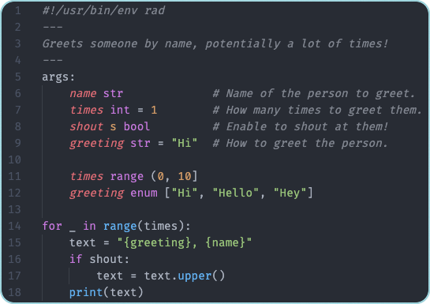

## What is Rad?

*If you want to jump straight to programming, feel free to skip forwards to [Installation](#installation).*

**Rad is a modern programming language and interpreter designed to make writing CLI scripts delightful.** It has a familiar, Python-like syntax with
built-in concepts like declarative arguments, JSON handling, first-class shell integration, and user prompts - making common scripting tasks easy and
fast to implement.

If you've ever written scripts and felt like your tools were fighting you, you're not alone:

**With Bash**, you might find yourself:

- Wrestling with `while getopts` boilerplate just to parse a few arguments
- Doing `curl | jq | awk` gymnastics to process JSON
- Skipping the "nice-to-haves" like `--help` or input validation because they're too painful to implement
- Delivering scripts that work, but are hard to read and harder to maintain

**With Python**, you get better syntax, but:

- You need argparse boilerplate before you even start solving your problem, or reach for additional libraries
- Sharing scripts means coordinating runtimes and dependencies
- Simple CLI tasks feel heavier than they should

**With Rad**, the language is purpose-built for CLI scripting:

- **Delightful to write** - familiar syntax without the footguns
- **Self-documenting** - automatic `--help` generation from your code comments
- **Declarative arguments** - type checking, validation, and parsing built into the language
- **Easy to share** - batteries included, no external dependencies needed

If you ever write a CLI script, **Rad is the language to do it in**.

**Project Status:** Rad is in early development but useful today for real scripts. Core features work well, though expect breaking changes between
versions as the language evolves. Your feedback directly shapes Rad's future!

Let's get into it.

## Installation

### macOS (Homebrew)

```bash
brew install amterp/rad/rad
```

### Go (from source, all platforms)

```bash
go install github.com/amterp/rad@latest
```

**Note:** You will need to run `go install` yourself to upgrade Rad as new versions are released.
For automated updates, use one of the supported package managers that allow it.

### Binary Downloads

Pre-built binaries for macOS, Linux, and Windows: [releases page](https://github.com/amterp/rad/releases)

### Checking Installation

After you've installed Rad and ensured it's on your PATH, you can check your installation:

```shell
rad -h
```

If this prints the help string for Rad, you're set!

## Visual Studio Code Extension

Rad has a VS Code extension [here](https://marketplace.visualstudio.com/items?itemName=amterp.rad-extension) which offers nice syntax highlighting and script validation.

Installing it is highly recommended!



## Your First Rad Script - Hello World

Let's write the classic "Hello, World!" program. We'll then modify it to give it a bit of a Rad twist, demoing a few features that Rad provides.

First, create a file, let's call it simply `hello`, and give it the following contents:

```rad linenums="1" hl_lines="0"
print("Hello, World!") 
```

!!! tip "`print()`"

    `print()` is the go-to function for outputting to stdout. It behaves a lot like `print()` in Python.

    You can read more about it [in the reference](../reference/functions.md#print).

!!! info "File Extension"

    If you want to give your Rad scripts an extension, you can follow `.rad` as a convention.

Then, run the script from your CLI by invoking `rad` on it, and you should see it print out like so:

```sh
> rad hello
```

<div class="result">
```
Hello, World!
```
</div>

Nice! Now, let's spruce it up with a few Rad features.

## Adding In Some Rad Features

One of Rad's primary features is its simple, declarative style to defining script arguments.

Let's modify the script to greet a name you input from command line.

```rad linenums="1" hl_lines="1-4"
args:
  name str

print("Hello, {name}!")
```

A couple of things to note here:

1. We define an "args block". Right now it contains just the one line, but [you can do lots of things in here](./args.md).
2. The modified `print()` utilizes [string interpolation](strings-advanced.md#string-interpolation). String interpolation in Rad behaves a lot like it does in Python (you'll see this is a pattern).

Now, let's try invoking the script again, and this time, input a name:

```sh
> rad hello Alex
```

<div class="result">
```
Hello, Alex!
```
</div>

Cool! What happens if we invoke *without* a name?

```sh
> rad hello
```

<div class="result">
```
Usage:
  hello <name>

Script args:
      --name str
```
</div>

If you run a Rad script without providing *any* args to a script which expects at least one, Rad will print out the script usage, interpreting your invocation as if you had passed `--help`.

This shows a little of the automatic script usage that Rad generates for you. Let's explore that a bit more.

## Improving The Script Usage String

Rad facilitates writing well-documented and easy-to-use scripts, in part through unique syntax. Let's use a couple of those now.

First, we'll add a **file header** to your script.

```rad linenums="1" hl_lines="1-3"
---
Prints a polite greeting using an input name.
---
args:
  name str
  
print("Hello, {name}!")
```

!!! tip "File Headers"

    File headers, as the name suggests, go at the top of Rad scripts (with the exception of shebangs, to be covered later). 
    They allow you to write a description for your script in between two `---` lines. The contents will get printed as part of the script's usage string.

    A couple of ideas on what to cover in your file headers:

    - A brief description of what the script does and how it works
    - Examples of valid invocations and what they do.

Second, we can add **comments** to args that a script declares. Let's do that too:

```rad linenums="1" hl_lines="5"
---
Prints a polite greeting using an input name.
---
args:
  name str  # The name of someone to greet.
  
print("Hello, {name}!")
```

!!! info "Note on `#` vs. `//`"

    Rad uses `#` to denote *arg* comments.
    `#` comments are special and **do get passed** to Rad's parser and can affect script behavior (namely in this case, adding information to the script usage string). 

    Standard code comments in Rad use `//`, similar to Java or C/C++, and **don't** impact script behavior.

Now, when someone reads the script, it's pretty clear what the script does and what the expected arguments are.

But it gets better! Let's try invoking the script's usage string again (this time let's try using the `-h` flag explicitly, though it's not necessary):

```sh
> rad hello -h
```

<div class="result">
```
Prints a polite greeting using an input name.

Usage:
  hello <name>

Script args:
      --name str   The name of someone to greet.
```
</div>

Not only is the script now easier to maintain for developers, it's also easier for users to understand!

## Shebang

Needing to manually invoke `rad` each time you want to run a Rad script can be a little cumbersome. Thankfully, Unix kernels provide a mechanism known as a "shebang".

Let's add one to our script. It has to go on the very first line.

```rad linenums="1" hl_lines="1"
#!/usr/bin/env rad
---
Prints a polite greeting using an input name.
---
args:
  name str  # The name of someone to greet.
  
print("Hello, {name}!")
```

Then, make the script executable using the following command:

```sh
chmod +x ./hello
```

Now, you can invoke the script directly:

```sh
> ./hello Bob
```

<div class="result">
```
Hello, Bob!
```
</div>

When you invoke an executable script this way, the Kernel scans for a shebang (`#!`) in the first line.
If it finds a path to an interpreter (in this case, it will find `rad`, if set up correctly in your `PATH`),
then it will invoke said interpreter on the script (equivalent to `rad hello` like we were doing before).

!!! tip "rad new"
    Rad has a command `rad new <script>` which saves you repeating these steps.
    It creates a ready-to-edit executable file with a `rad` shebang on the top.

## Summary

- We learned how to print, and saw an example of **string interpolation**.
- We were introduced to the **args block**
- We saw how we can write self-documenting scripts that also help our users by leveraging **file headers** and **arg comments**.
- We saw how we can leverage **shebangs** to make our scripts more convenient to run.

!!! info "Note on Rad script content ordering"

    Rad expects a certain order between shebangs, file headers, arg blocks, and the rest of your code.

    **It's important to adhere to the following ordering in Rad scripts**, or you'll see errors:
    
    1) Shebang (if present)
  
    2) File header (if present)
    
    3) Args block (if present)
    
    4) Rest of the file

## Next

Great job on getting this far! You've gotten a small peek at what Rad has to offer.

From here, you have a couple of options:

1. Continue your Rad journey: dive into more details with the next section: [Basics](./basics.md).

2. If you'd like to see additional unique Rad features, here are some sections you can jump to:
    - [Args](./args.md)
    - [Rad Blocks](./rad-blocks.md)
    - [Shell Commands](./shell-commands.md)
    - [Example: brewi](../examples/brewi.md)

[//]: # (TODO pick_from_resource ^)
