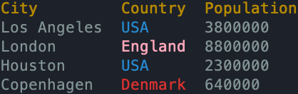

This section discusses another unique RSL concept, including **rad blocks**.
These allow you to easily and concisely define queries to JSON APIs and what data you want to extract from the response, so that it can be displayed as a nice, readable table.

## Basic Example

This concept will become clearer with an example.

Below is a simple script capable of querying a given GitHub repo (leveraging GitHub's public API) for information about its latest commits.

```rsl title="File: commits"
args:
    repo string    # The repo to query. Format: user/project
    limit int = 20 # The max commits to return.
    
url = "https://api.github.com/repos/{repo}/commits?per_page={limit}"

Time = json[].commit.author.date
Author = json[].commit.author.name
SHA = json[].sha

rad url:
    fields Time, Author, SHA
```

Here's an example of running it, and the command line output:

```shell
rad commits amterp/rad 5
```

<div class="result">
```
Querying url: https://api.github.com/repos/amterp/rad/commits?per_page=5
Time                  Author          SHA
2025-01-11T04:15:06Z  Alexander Terp  306f3a4ddb3b09747d61a5eab264c3d72fbbc36e
2025-01-11T03:07:56Z  Alexander Terp  304a914644dfd73a59b85a191481f9c429b4d25e
2025-01-11T01:00:42Z  Alexander Terp  7171ec92ae729f9d04e224e16272c9b888dffe41
2025-01-10T12:11:08Z  Alexander Terp  4b64f585d08d9a5ee40549b6b9624530ac713eb1
2025-01-09T11:34:51Z  Alexander Terp  abfcf2d940a18b819f7ae9e9040550a9644e5120
```
</div>

This is a simple example, but it demonstrates the ability to query GitHub's API (which returns JSON), extracting fields we're interested in (commits' time, author, and hash string).

And that's with just a few lines of code! Let's break it down piece by piece.

### Arg Block

```rsl
args:
    repo string    # The repo to query. Format: user/project
    limit int = 20 # The max commits to return.
    
url = "https://api.github.com/repos/{repo}/commits?per_page={limit}"
```

Here we have an [args block](./args.md) where we declare a `repo` string and a `limit` int with a default of 20.
After the args block, we create a `url` string using [string interpolation](strings-advanced.md#string-interpolation) to fill in the repo name, and the limit for how many commits we want GitHub to give us.

### Json Field Definitions

```rsl
Time = json[].commit.author.date
Author = json[].commit.author.name
SHA = json[].sha
```

This is where things get more interesting. The above definitions correspond to expected *paths* in the JSON response i.e. a series of keys to look up.

In RSL nomenclature, we refer to these as **json field definitions**.

If you query GitHub's API and take a look at the JSON response, you can see how these fields correspond to the data.
Example URL if you want to see for yourself:

<a href="https://api.github.com/repos/amterp/rad/commits?per_page=2" target="_blank">https://api.github.com/repos/amterp/rad/commits?per_page=2</a>

Here's a simplified example response with two commits, showing the structure we're interested in:

```json
[
  {
    "sha": "306f3a4ddb3b09747d61a5eab264c3d72fbbc36e",
    "commit": {
      "author": {
        "name": "Alexander Terp",
        "date": "2025-01-11T04:15:06Z"
      }
    }
  },
  {
    "sha": "306f3a4ddb3b09747d61a5eab264c3d72fbbc36e",
    "commit": {
      "author": {
        "name": "Alexander Terp",
        "date": "2025-01-11T04:15:06Z"
      }
    }
  }
]
```

You can see how the path for `Author = json[].commit.author.name` corresponds to a final value of "Alexander Terp".

Json field definitions leverage a special syntax that RSL offers. They always start with `json`.
`json` can be thought of as representing the JSON blob as a whole, or its root, if you want to think of the JSON data as a tree.

The `[]` after `json` tells RSL that you expect the `json` blob to be a list, and to "unwrap" it and dig into individual items in that list for the remainder of the path.
`commit` then tells it to look up a key of that name (literally `commit`), and to then look up `author` next, and then finally `name`.

The json field definition syntax can do a lot of things that we won't cover here. For details, see its [reference page](../reference/json-field-definition.md).

[//]: # (TODO ^ make the above page)

When the json field assignment is executed, its variable (`Author` for example) is initialized as an empty list.
It's a "special" list though, as it has a json field definition tied to it, which can be used in a rad block, let's look at that one next.

### Rad Block

```rsl
rad url:
    fields Time, Author, SHA
```

`rad` is a keyword. As with the name of the interpreter and CLI tool which runs it, it stands for "Request And Display", to give you an idea for what it does.

Following the `rad` keyword, we provide the `url` variable which will get used to execute an `HTTP GET` request.
Then, inside the rad block itself, using the keyword `fields`, we specify the earlier json fields that we defined.
Listing them here will tell the rad block to extract data from the resulting JSON blob according to the json field paths that you defined.
The ordering in which the fields are listed also controls the ordering of columns in the ensuing table that gets printed.

When run, this will print the table we saw earlier; here it is again for reference (with a limit of 3).

```
Time                  Author          SHA
2025-01-11T04:15:06Z  Alexander Terp  306f3a4ddb3b09747d61a5eab264c3d72fbbc36e
2025-01-11T03:07:56Z  Alexander Terp  304a914644dfd73a59b85a191481f9c429b4d25e
2025-01-11T01:00:42Z  Alexander Terp  7171ec92ae729f9d04e224e16272c9b888dffe41
```

Note that the variable names we choose for the json field definitions become the header names in the table.

## Additional Rad Block Options

Rad blocks offer additional syntax for controlling what your final table looks like.

### Sorting

By default, the rows in your table are sorted by their original order in the JSON blob. However, you can control this.

Let's say we have the following table by default:

```
City         Country  Population
Los Angeles  USA      3800000
London       England  8800000
Houston      USA      2300000
Copenhagen   Denmark  640000
```

The simplest sorting option is alphabetically, across the whole row.

```rsl
rad url:
    fields City, Country, Population
    sort
```

<div class="result">
```
City         Country  Population
Copenhagen   Denmark  640000
Houston      USA      2300000
London       England  8800000
Los Angeles  USA      3800000
```
</div>

What if we wanted to sort by Country, though? And then break ties with City? We can do that:

```rsl
rad url:
    fields City, Country, Population
    sort Country, City
```

<div class="result">
```
City         Country  Population
Copenhagen   Denmark  640000
London       England  8800000
Houston      USA      2300000
Los Angeles  USA      3800000
```
</div>

If we wanted to sort by descending population, you can add `desc` after the name of the column:

```rsl
rad url:
    fields City, Country, Population
    sort Population desc
```

<div class="result">
```
City         Country  Population
London       England  8800000
Los Angeles  USA      3800000
Houston      USA      2300000
Copenhagen   Denmark  640000
```
</div>

!!! note "'asc' is the default"

    `sort City` and `sort City asc` are both valid and identical in functionality - you can include it if you want to be explicit.

### Mapping

You can also *transform* a column's values before it gets printed.

For example, let's say you wanted the 'Population' column in the above example to be in millions, and to display one decimal place, you can do that with a `map` column modifier:

```rsl
rad url:
    fields City, Country, Population
    Population:
        map p -> "{p/1000000:.1}"
```

If we run this, you'll see the change:

```
City         Country  Population
Los Angeles  USA      3.8
London       England  8.8
Houston      USA      2.3
Copenhagen   Denmark  0.6
```

This example is actually using string interpolation formatting, which we haven't covered yet, so is a bit of a preview. Let's break down this syntax though. After declaring the fields:

[//]: # (TODO link to string interpolation formatting section when added, above)

```rsl
Population:
    map p -> "{p/1000000:.1}"
```

`Population:` begins a column modifier block. The identifier prior to the colon is expected to be one of the fields. Inside one of these blocks, you can apply modifiers on that column, such as `map` or [`color`](#color).

[//]: # (todo mention can apply to multiple columns at once?)

`map` is considered a keyword in the context of rad blocks. After `map`, a lambda expression is expected, which you can think of as a mini-function.

In this case, we've written `p -> "{p/1000000:.1}"`. Left of the arrow is an identifier `p` (name could be any valid identifier). This will represent an individual value in the `Population` list.
Right of the arrow is an expression for what that entry in the list should *become*.
It is the *output* of your lambda mini-function. In this example, we turn it into a string, created using string interpolation.


Inside the string interpolation expression, we first divide it by one million (`p/1000000`), and then use formatting syntax (right of the colon) to specify that we want the resulting float to be stringified with one decimal place (`.1`).

[//]: # (todo visual aid perhaps, to demonstrate what the lambda is doing exactly?)

Note that sorting operations are done on the pre-mapping column values.

### Color

Another column modifier uses the keyword `color`. You can tell rad to color a cell's value depending on its contents by using a [regex](https://en.wikipedia.org/wiki/Regular_expression).

For example:

```rsl
rad url:
    fields City, Country, Population
    Country:
        color "pink" ".*"
        color "red" "Denmark"
        color "blue" "USA"
```

The syntax is `color <color> <regex>`. You can apply multiple rules, and later rules override earlier ones. 
For example, here we start off by coloring *everything* pink.
Then, we add three more rules: any sequence "Denmark" should be colored red, and "USA" should be colored blue.



This screenshot from a terminal demonstrates the colors. England is colored pink because the initial `.*` rule is the only regex that matched it.

Note that the specific colors that appear varies between terminals and user settings.

See the [reference](../reference/rad-blocks.md#colors) for a list of valid colors.

### If Statements

Rad blocks can contain if statements, so if you want slightly different behavior for your rad block based on some condition, you don't need to
copy and paste the whole block into two separate if blocks.

Let's say your script had a flag for sorting by population or not. Here's an example of how that could look:

```rsl
args:
    sort_by_population "sort-by-population" p bool  # Enable to sort by population.

// ... some script stuff here

rad url:
    fields City, Country, Population
    if sort_by_population:
        sort Population desc
    else:
        sort
```

If the flag is enabled, we sort by descending population, otherwise we sort rows alphabetically.

You can put any rad block statements into these if blocks, including `fields`, column modifiers, etc.

## Request Blocks

There are two other types of rad blocks: "request" blocks and "display" blocks. Let's first discuss the former.

A request block is similar to a `rad` block, however it does not print out any table after executing its query and
field extraction steps. You can use them to just query and extract fields from a returned json blob and stop there -
allowing you to separately process the populated json fields/lists further if need be, or do whatever else you'd like.

Generally the syntax is very similar between `request` and `rad` blocks.

```rsl
request url:
    fields City, Country, Population
    
// from here the above fields' lists are populated with extracted values
```

Naturally, block statements like sorting or coloring have no effect, and may be considered invalid and error.

[//]: # (todo we should not use 'may' wording, we should decide and be clear RAD-106)
[//]: # (todo need to update this section when we allow giving json blobs directly to the display or request blocks or rad blocks)

!!! note "Wait, so is a request block *different* from a rad block, or is it a *type* of rad block?"

    We generally consider "display" and "request" blocks to be *types* of rad blocks, just with slightly different
    syntax and behavior. We may still compare them to *the* rad block (i.e. the one using `rad` as its keyword) when
    discussing differences however - it depends on the context in which they're discussed.

[//]: # (todo should mention that you can FOREGO the json fields extraction algo - simply save the response. tho tbh, should I just reprecate that and tell people to use http_get? I think so)

## Display Blocks

Display blocks are the opposite side of the coin from request blocks.
Where the request blocks will perform a request, populate your lists, and *not* print, the display block will simply take
already-populated lists and display them as a table.

To demonstrate, you can even manually populate your lists (columns) and use them as fields for the table:

```rsl
Nums = [1, 2]
Words = ["hi", "hello"]
display:
    fields Nums, Words
```

<div class="result">
```
Nums  Words
1     hi
2     hello
```
</div>

Notice `display` does not take any `url` or equivalent thereof, as it doesn't perform any requests, and gets all it needs
from the specified `fields`.

!!! tip "Combining request and display blocks"

    Sometimes you want to display more information in your table than the JSON blob itself provides.
    For example, you may wish to derive an additional column off two others. To accomplish this, you can write a
    `request` block, derive whatever additional columns you want, and then write a `display` block to print your final
    range of columns.

    For example:

    ```rsl
    request url:
        fields width, height

    area = [width[i] * height[i] for i in range(width)]

    display:
        fields width, height, area
    ```

[//]: # (todo RAD-107 might change this dynamic)

## Learnings Summary

- RSL provides first-class support for scripts whose primary purpose is to query a JSON API and present parts of its response in a useful, readable table.
- This is offered by the `rad` blocks, and its siblings `display` and `request`.
- RSL has syntax for specifying **json field definitions** or **json field paths**, that rad blocks can then use to extract fields from a JSON blob response.
    - e.g. `Author = json[].commit.author.name`
- Rad blocks offer customization options, such as coloring, transforming cell values, and sorting.
  - You can also use if statements inside them.

## Next

RSL offers a range of useful built-in functions to help you write your scripts. We'll take a look at those in the next section: [Functions](./functions.md).
